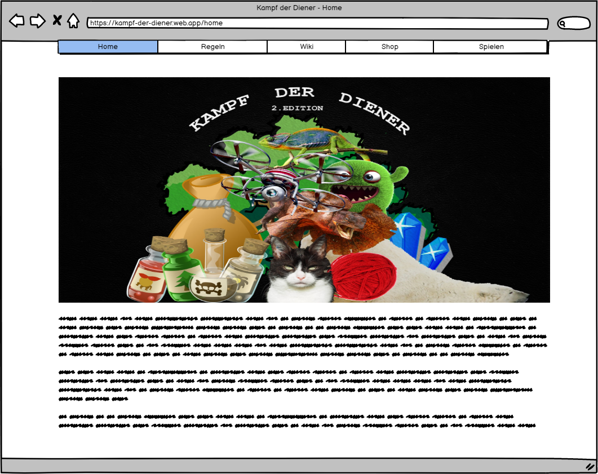
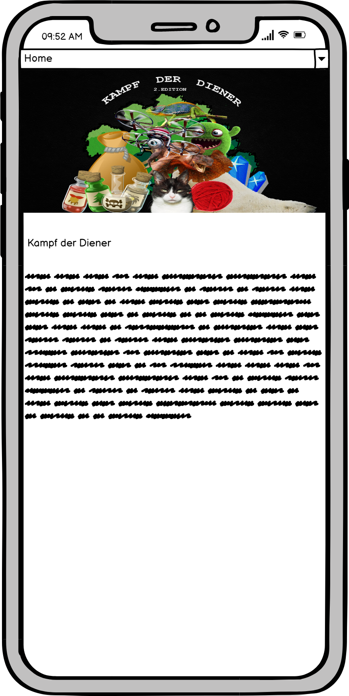
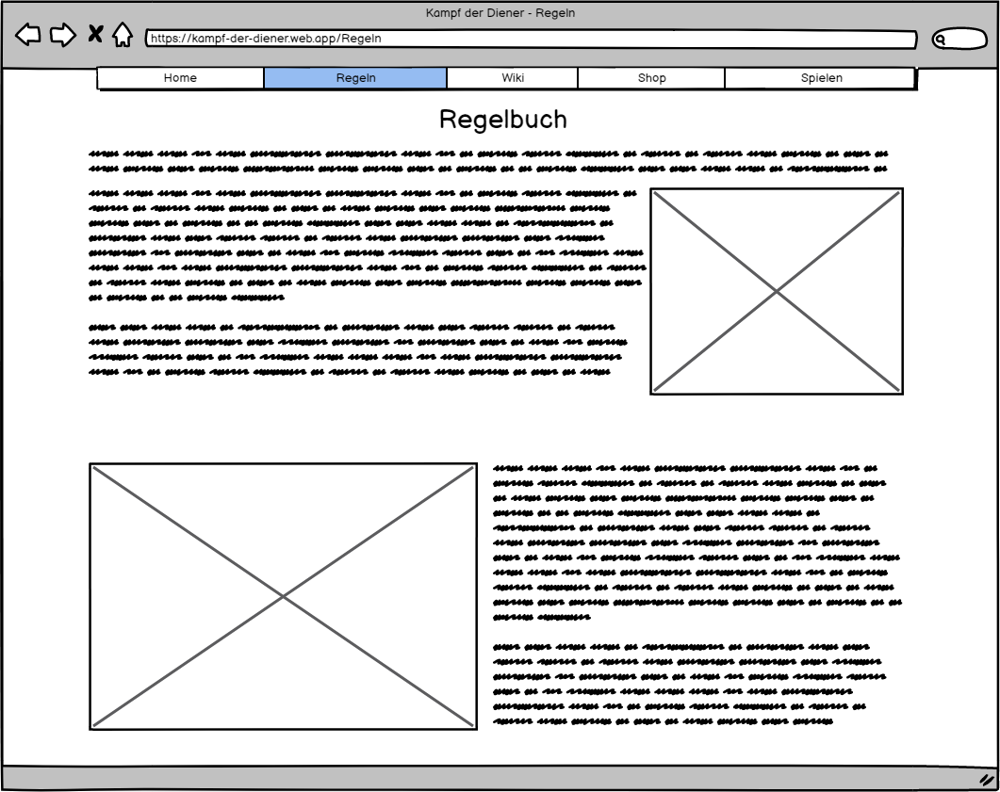
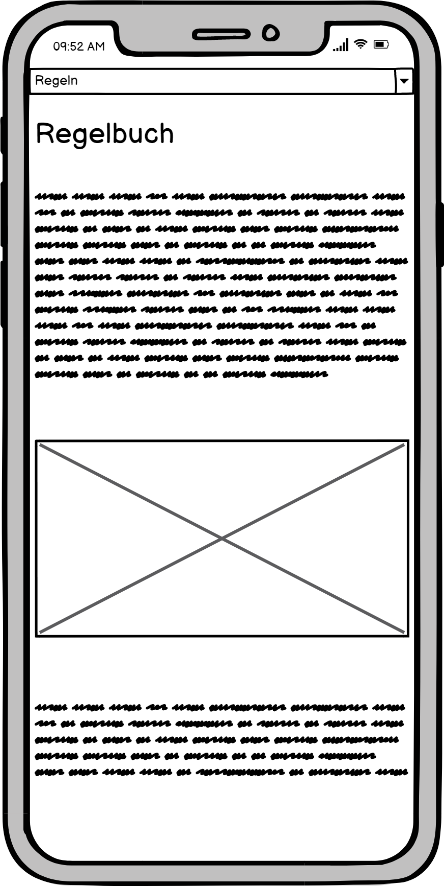
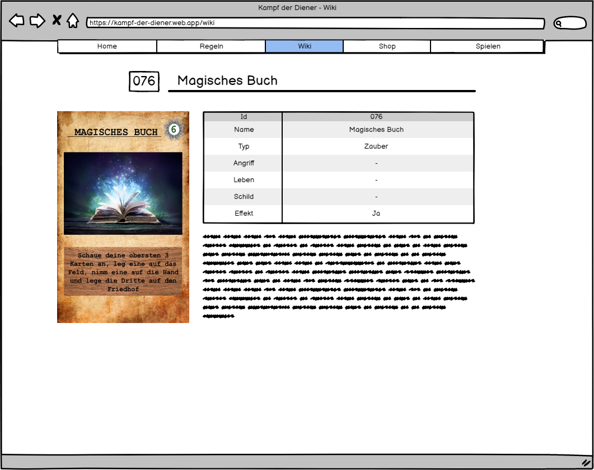
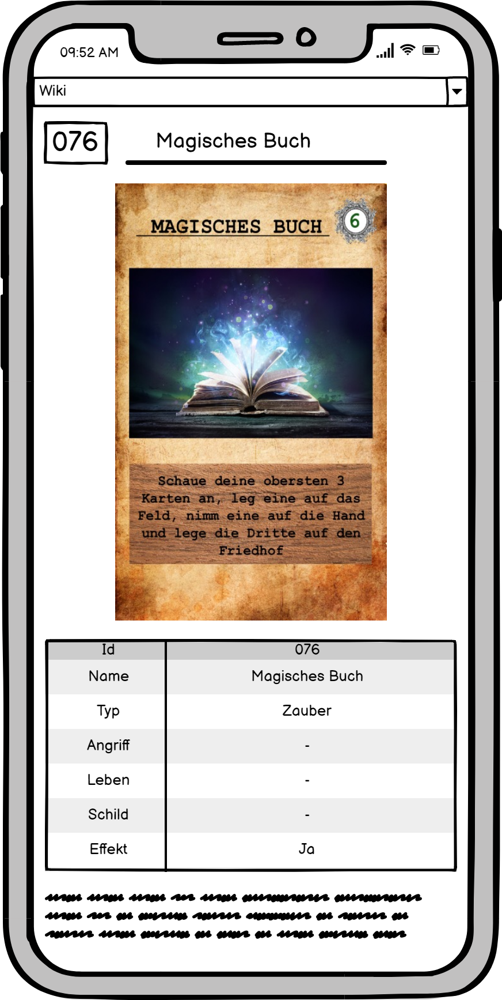
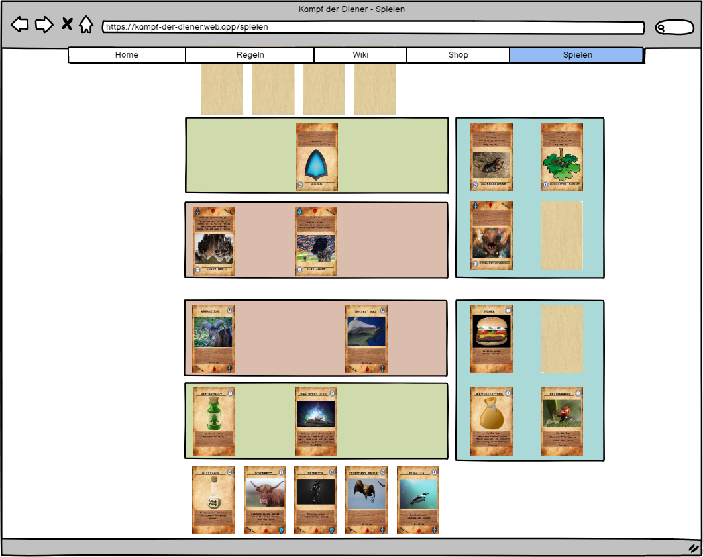

# Mockups

Um unser Konzept mithilfe von Bildern zu festigen, haben wir uns für Mockups entschieden. In diesen widerspiegel wir unsere Umsetzungspläne bildlich.
Die Seiten sollen übersichtlich und schön sein. Gleichzeitig wollen wir sie aber auch möglichst Informativ gestalten.
Das genaue Design der Menu Bar wird sich über die Zeit der Projektarbeit verändern. Mit dem verwendeten Tool konnten wir jedoch nur dieses Design verwenden.

## Home

## Regeln

## Wiki

## Spielen und Tutorial

> Das Kartenspiel soll nicht Responsive sein.
>
> Deswegen gibt es auch kein Mobile Mockup für diese Seite.

