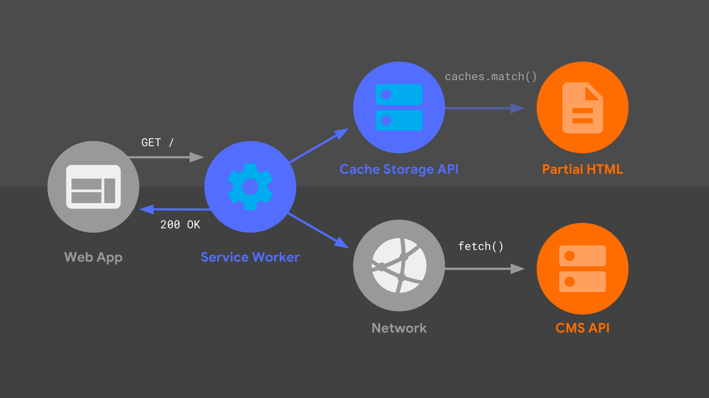
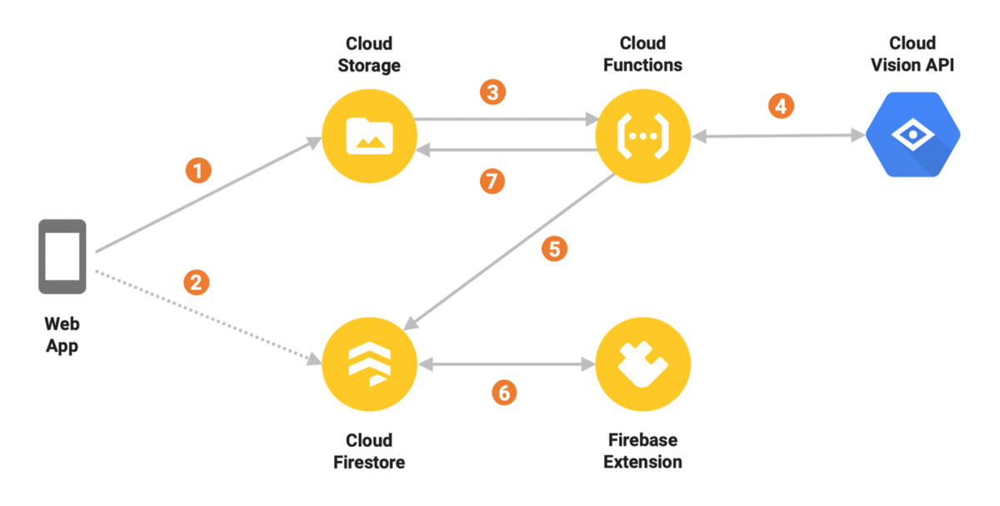

# Projektumfeld

## Systemgrenzen

### Fronted

Mit dem [Angular Framework](https://angular.io/) können wir unseren Single Page Webauftritt einfach erstellen.
Dabei ist Angular, wie eine App aufgebaut, die aus vielen unter Komponenten, Services und Modules besteht.
Hier eine grafische Darstellung der Angular Architektur:  
  
*Quelle: <https://s3.amazonaws.com/oodles-technologies1/blog-images/9c26b668-ac50-402d-bd87-b6bdac3d6eb7.jpeg>*

Ausserdem erläutern wir kurz, die einzelnen Teile der Angular Architektur:

- **Module:** In Angular sind Apps modular aufgebaut. Mit Module werden Komponenten und Templates untegeordnet.
- **Template:** Ist das HTML der Komponente.
- **Metadata:** Grundinformationen der App.
- **Component**: Komponenten sind die einzelnen Seiten der App. Die HTML, CSS oder SCSS, Test und Typescript beinhalten.
- **Services**: In Services können Daten durch zum Beispiel HTTP Client aufgerufen werden.
- **Directive**: Mit Direktiven können repetiven Anweisungen definiert werden. Die im Template wiederverwenden werden können.

#### PWA

Damit unsere App nicht im App Store oder Play Store zur Verfügung gestellt werden muss, haben wir uns für die PWA Methode entschieden.

Eine Progressive Web App ist eine Website, die zahlreiche Merkmale besitzt, die bislang nativen Apps vorbehalten waren.
Sie kann daher auch als Symbiose aus einer responsiven Webseite und einer App beschrieben werden.
In Angular können PWA simpel durch Installierung des [@angular/pwa](https://github.com/angular/angular/blob/master/packages/service-worker/PACKAGE.md) Package eingerichtet werden.
Auch hat Angular Service Worker coole Interaktionsmöglichkeiten von PWA und Angular, wie zum Beispiel Push Benachrichtigungen.

Hier eine grafische Darstellung der PWA Architektur:  

*Quelle: <https://developers.google.com/web/updates/2018/05/images/beyond-spa/sw-diagram.png>*

### Backend

Grundsätzlich verwenden wir kein kompliziertes Backend.
Also mit [Firebase](https://firebase.google.com/?gclid=CjwKCAiA_Kz-BRAJEiwAhJNY77YTjGqSSgsSSOLwD1eIsQD6xitIdvYir1lJJ05fd7XDPENJV_G2FBoCe5gQAvD_BwE) können wir folgende Aufgaben erledigen:

- **Hosting**: Hosting der App und durch vorgegebenen oder benutzerdefinierten Domäne erreichbar.
- **Authentification**: Authentifizierung mit Logins und Sign-On umsetzbar (wird in diesem Projekt nicht angewendet!).
- **Realtime Database**: Lesen, Schreiben und Aktualisierung von Daten, die in der App verwendet werden.
- **Storage**: Lagern von Bilder, die in der App verwendet werden.

Hier eine grafische Darstellung der Firebase Archtiektur:  

*Quelle: <https://miro.medium.com/max/1200/1*KiZxavjHmHNr9_VeBm0r3w.png>*

## Schnittstellen

### Github

Als Quellcodeverwalter verwenden wir das bereits sehr berühmte [Github](https://github.com/).
Dort können wir Github Actions verweden, das unser CI (Continous Integration) regelt.

#### Github Actions - CI

Mit GitHub Actions können wir unsere Software-Workflows mit CI / CD auf einfache Weise automatisieren.
In unseren [CI](../../.github/workflows/master.yml) werden für die einzelen Actions Stages erstellt.
Somit kann die App gebuildet, getestet, kompalität prüfen und schlussendlich veröffentlicht werden.

Hier eine grafische Darstellung unseres CI:

*Quelle: <https://dzone.com/storage/temp/13365213-workflow.png>*
