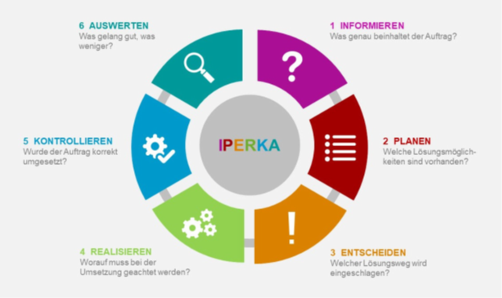

# Projektmethode

Wir haben uns für die Projektmethode IPERKA entschieden.
Die Projektmethode IPERKA teilt das Projekt in 6 Schritte auf.

## Schritt 1
Im ersten Schritt soll der Auftrag verstanden werden. Man muss sich ein genaues Ziel vor die Augen setzen und sagen können: Ja, so soll das Resultat aussehen.

## Schritt 2
Im Schritt Planen werden verschiedene Lösungsmöglichkeiten ausgearbeitet. Diagramme und Skizzen von Nutzeroberflächen sollen bei jeder Möglichkeit die Möglichkeiten und Grenzen aufzeigen.

## Schritt 3
Aus dem Schritt Entscheiden geht eine der Lösungsmöglichkeiten als Sieger hervor. Fragen und Abläufe sollen geklärt werden. Das Projektteam soll am Ende dieses Schrittes schon ein klares Bild des Endproduktes haben.

## Schritt 4
In diesem Schritt werden die Entwicklungsanforderungen effektiv umgesetzt. Am Ende ist es nicht mehr ein einfacher Plan mit ein paar Skizzen, sondern ein richtiges Produkt. 

## Schritt 5
5	Mit den Schritt Kontrollieren werden die Entwicklungen aus dem Schritt Realisieren genau angeschaut und getestet. Fehler werden ausgebessert und das Programm erneut getestet. Am Ende dieses Schrittes steht ein Produkt, welches so dem Kunden zur Verfügung gestellt werden kann.

## Schritt 6
Durch diesen Schritt werden die Abläufe im Projekt nochmal angeschaut. Was lief gut, was weniger? Was kann man beim nächsten Mal verbessern? 

## Quelle:
https://www.i-be.ch/images/pdf_dateien/Iperka_OdA_200617.pdf

